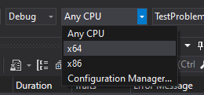

# Tech Challenge

1. Clone the repository to a Windows machine:

```console
$ git clone https://github.com/gui5/TestSwDev.git
```

2. Open the solution in Visual Studio 2019.

3. Change the solution platform to x64:

   

## Remarks

Problems 1 and 2 are in C++ and problems 3 and 4 are in C#.

The solutions for each problem were implemented as libraries, the C++ ones are static libs (.lib) and C# ones are dynamic linked libraries (.dll).
